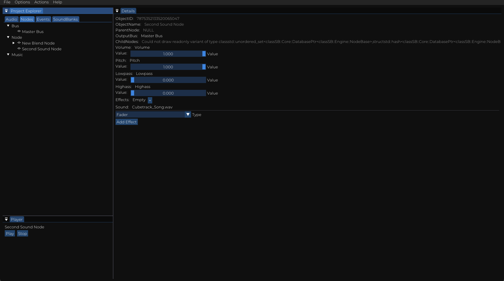

# Sound Bakery

*Sound Bakery is currently under development!*

Sound Bakery is an open-source audio middleware tool with an editing workflow like Wwise and an API like FMOD.

It is built on [miniaudio](https://miniaud.io/index.html) for audio playback and ImGui for editing.

The library ships with a cross-platform editor application and a `Sound Bakery` library for integration with engines.

It aims to be highly customisable and editable, making it suitable for many games and scenarios.

# Features
- Cross-platform authoring application
- C, C++ and C# API
- Convert and package audio in SoundBanks

# Building

Sound Bakery requires [Git](https://git-scm.com) for fetching dependencies and [CMake](https://cmake.org).

- Create a build directory: `mkdir build && cd build`
- Generate the build files using CMake: `cmake ..`
- Build the project: `make`

# Running The Authoring Application
Run the executable.