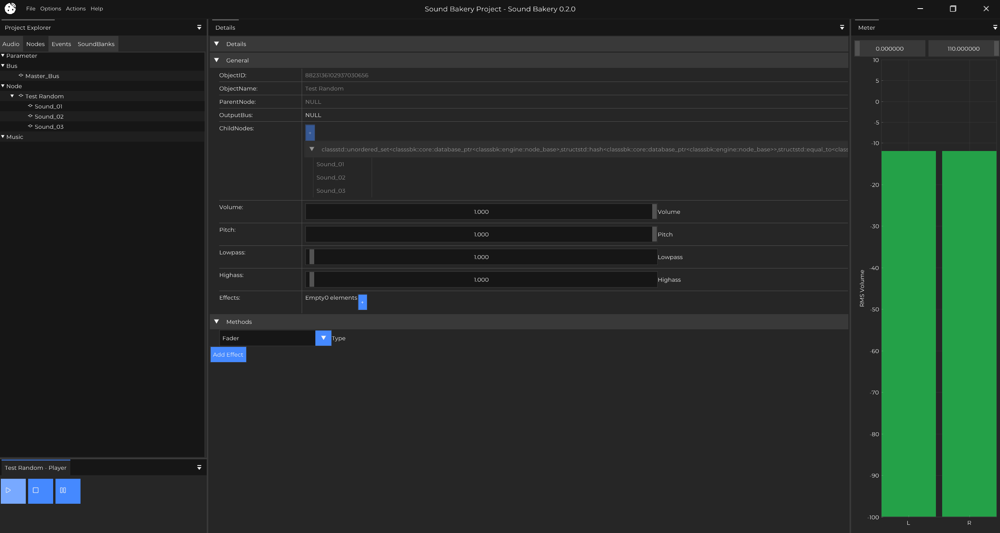

# Sound Bakery

<div align="center">

[](https://github.com/KarateKidzz/sound-bakery/actions/workflows/windows.yaml)
[](https://github.com/KarateKidzz/sound-bakery/actions/workflows/macos.yaml)
[](https://github.com/KarateKidzz/sound-bakery/actions/workflows/linux.yaml)
[](https://opensource.org/licenses/MIT)
[](https://en.cppreference.com/w/cpp/compiler_support#cpp20)
[](#)
[](https://github.com/KarateKidzz/sound-bakery)
[](https://github.com/KarateKidzz/sound-bakery/graphs/contributors)

[Why?](#why-choose-sound-bakery) • [Goal](#goal) • [Getting Started](#getting-started) • [Contributing](#contributing) • [Docs](https://soundbakery.jameskelly.audio)

</div>

**Sound Bakery** is a free and open-source audio middleware tool featuring a complete authoring application and C/C++ API. Integrate with game engines with full support for asset management, sound selection, packaging, playback, and debugging.



## Why Choose Sound Bakery?

From Blender and Krita to Godot, more and more developers are choosing open-source alternatives. Sound Bakery is the open choice for game audio.

| Effective | Modern | Open |
| --- | --- | --- |
| Full authoring application, powerful API, and built-in multithreading make Sound Bakery a competitive choice. | Modern tech stack: GitHub CI/CD, C++ 20, CMake, and current libraries. | Free, modifiable, and MIT licensed. No restrictions on cost or usage. |

## Goal

Sound Bakery aims to be a competitive, open alternative to Wwise and FMOD. Imagine owning your audio engine—customizing its look, tools, behavior, and more. Imagine receiving features and fixes from top studios, all collectively improving the industry's tools.

See our [Roadmap](docs/Roadmap.md) for upcoming features and direction.

## Getting Started

### Quick Start

Looking for binaries? Check out the [Releases](https://github.com/KarateKidzz/sound-bakery/releases) page for prebuilt binaries and source code.

### Build from Source

**Prerequisites:**
- C++ compiler (GCC, Clang, or MSVC)
- CMake 3.28+
- Git

**Installation:**
```bash
git clone https://github.com/KarateKidzz/sound-bakery.git
cd sound-bakery
mkdir build && cd build
cmake ..
make
```

### Usage Example

```cpp
#include "sound_chef.h"

int main() {
    sc_system* system = nullptr;
    sc_system_create(&system);
    sc_system_init(system);

    sc_sound* sound = nullptr;
    sc_system_create_sound(system, "some_sound.wav", SC_SOUND_MODE_DEFAULT, &sound);

    sc_sound_instance* instance = nullptr;
    sc_system_play_sound(system, sound, &instance, nullptr, SC_FALSE);

    return 0;
}
```

### Documentation

Full documentation is available at **[soundbakery.jameskelly.audio](https://soundbakery.jameskelly.audio)**.

## Contributing

Sound Bakery welcomes contributions from developers of all backgrounds—UI/UX artists, DSP programmers, documentation writers, and more.

- **Found a bug?** [Open an issue](https://github.com/KarateKidzz/sound-bakery/issues)
- **Have an idea?** Start a [discussion](https://github.com/KarateKidzz/sound-bakery/discussions)
- **Ready to code?** [Fork the repo](https://github.com/KarateKidzz/sound-bakery/fork) and submit a pull request

See our [Contributing Guidelines](CONTRIBUTING.md) for more information.

## License

Sound Bakery is licensed under the **[MIT License](LICENSE)**. You are free to use, modify, and distribute this software.

## Acknowledgements

Sound Bakery stands on the shoulders of amazing open-source projects. We're grateful to the following libraries and their creators:

**Audio**
- [miniaudio](https://github.com/mackron/miniaudio) • [ogg](https://github.com/xiph/ogg) • [vorbis](https://github.com/xiph/vorbis) • [opus](https://github.com/xiph/opus) • [CLAP](https://github.com/free-audio/clap)

**Rendering & Editor**
- [Dear ImGui](https://github.com/ocornut/imgui) • [GLFW](https://www.glfw.org) • [ImPlot](https://github.com/epezent/implot) • [Native File Dialog](https://github.com/mlabbe/nativefiledialog) • [IconFontCppHeaders](https://github.com/juliettef/IconFontCppHeaders)

**Core Libraries**
- [boost](https://www.boost.org) • [yaml-archive](https://github.com/james-e-kelly/yaml-archive) • [concurrencpp](https://github.com/james-e-kelly/concurrencpp) • [{fmt}](https://github.com/fmtlib/fmt) • [spdlog](https://github.com/gabime/spdlog) • [rttr](https://github.com/KarateKidzz/rttr) • [CMakeRC](https://github.com/vector-of-bool/cmrc) • [Cpp Delegates](https://github.com/KarateKidzz/CppDelegates) • [stb](https://github.com/nothings/stb) • [bytesize](https://github.com/eudoxos/bytesize) • [dirent](https://github.com/tronkko/dirent) • [out_ptr](https://github.com/soasis/out_ptr)

**Testing & Documentation**
- [doctest](https://github.com/doctest/doctest) • [Doxygen](https://www.doxygen.nl) • [Doxygen Awesome](https://github.com/jothepro/doxygen-awesome-css)