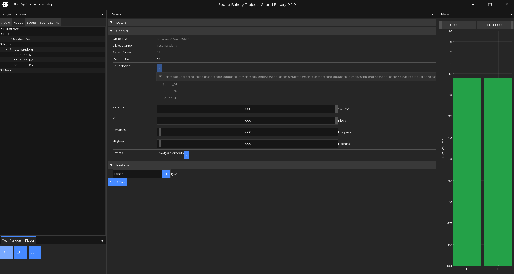

<h1>Sound Bakery</h1>

| Windows | MacOS | Linux | License | C++<br>Standard | Version |
| ------- | ----- | ----- | ------- | --------------- | ------- |
| [](https://github.com/KarateKidzz/sound-bakery/actions/workflows/windows.yaml) | [](https://github.com/KarateKidzz/sound-bakery/actions/workflows/macos.yaml) |[](https://github.com/KarateKidzz/sound-bakery/actions/workflows/linux.yaml)  | [](https://opensource.org/licenses/MIT) | [](https://en.cppreference.com/w/cpp/compiler_support#cpp20) |  |

<div align="center">
    <a href="#why-choose-sound-bakery">Why?</a> • <a href="#goal">Goal</a> • <a href="#getting-started">Getting Started</a> • <a href="#contributing">Join</a>
</div>
<p></p>

Sound Bakery is a free and open-source audio middleware tool. The tool comes packaged with an authoring application and C/C++ API for integration with game engines. It supports the entire audio pipeline, from asset management, sound selection, packaging, playback and debugging.



## Why Choose Sound Bakery?

From Blender and Krita to Godot, more and more developers are choosing open-source alternatives for their projects. Sound Bakery is the open choice for game audio. 

| Effective | Modern | Open |
| --- | --- | --- |
| With a full authoring application, powerful API, and multithreading built in, Sound Bakery is a competitive choice. | Sound Bakery is a tool for the modern era - Github hosting with CI, C++ 20, CMake, modern libraries and more. | Don't be restricted by cost or license. Sound Bakery is free, modifiable and MIT licensed. |

## Goal

Sound Bakery aims to be a competitive option to Wwise and FMOD that is more collaborative and open. Imagine owning your audio engine and being able to customise its look, tools, behaviour, and more. Imagine receiving features and fixes from top studios, all collectively improving the tools of the industry.

Check out the [roadmap](docs/Roadmap.md) for where Sound Bakery is going!

## Getting Started

Looking for binaries? Check out the [releases](https://github.com/KarateKidzz/sound-bakery/releases) page for prebuilt binaries and source code. Otherwise, see how to build from source.

### Prerequisites
Ensure the following are installed:

- A C++ compiler (e.g., GCC, Clang, MSVC)
- CMake (version 3.28 or higher)
- Git

### Installation
Clone the repository and build the project:

```
git clone https://github.com/KarateKidzz/sound-bakery.git
cd sound-bakery
mkdir build
cd build
cmake ..
make
```

### Usage
Here's a simple example to get started with Sound Bakery:

```cpp
#include "sound_chef.h"

int main() {
    sc_system* system = NULL;
    sc_system_create(&system);
    sc_system_init(system);
 
    sc_sound* sound = NULL;
    sc_system_create_sound(system, "some_sound.wav", SC_SOUND_MODE_DEFAULT, &sound);
 
    sc_sound_instance* instance = NULL;
    sc_system_play_sound(system, sound, &instance, NULL, SC_FALSE);

    return 0;
}
```

### Documentation

For documentation and guides, visit [soundbakery.jameskelly.audio](https://soundbakery.jameskelly.audio).

## Contributing
Sound Bakery needs **you**! From UI/UX artists to DSP programmers, the project needs yours skills.

Found a bug or want to request a feature? Open an [issue](https://github.com/KarateKidzz/sound-bakery/issues).

Want to talk about the project? Start a [discussion](https://github.com/KarateKidzz/sound-bakery/discussions).

Ready to make a change? Create a [fork](https://github.com/KarateKidzz/sound-bakery/fork).

All contributions are welcome!

For more details, check out our [contributing guidelines](CONTRIBUTING.md).

## License
Sound Bakery is licensed under the MIT License. See the LICENSE file for more information.

## Acknowledgements
Sound Bakery relies on some amazing open-source libraries. Thank you to the following libraries, creators, contributors and maintainers.

| Audio | Rendering/Editor | Code | Testing/Documentation |
| ----- | ---------------- | ---- | --------------------- |
| [miniaudio](https://github.com/mackron/miniaudio.git) | [Dear ImGui](https://github.com/ocornut/imgui.git) | [boost](https://www.boost.org) | [doctest](https://github.com/doctest/doctest.git) |
| [ogg](https://github.com/xiph/ogg.git) | [GLFW](https://www.glfw.org) | [yaml-archive](https://github.com/james-e-kelly/yaml-archive.git) | [Doxygen](https://www.doxygen.nl) |
| [vorbis](https://github.com/xiph/vorbis.git) | [ImPlot](https://github.com/epezent/implot.git) | [concurrencpp](https://github.com/james-e-kelly/concurrencpp.git) | [Doxygen Awesome](https://github.com/jothepro/doxygen-awesome-css.git) |
| [opus](https://github.com/xiph/opus.git) | [Native File Dialog](https://github.com/mlabbe/nativefiledialog.git) | [{fmt}](https://github.com/fmtlib/fmt.git) | |
| [CLAP](https://github.com/free-audio/clap.git) | [IconFontCppHeaders](https://github.com/juliettef/IconFontCppHeaders.git) | [spdlog](https://github.com/gabime/spdlog.git) | |
| | | [rttr](https://github.com/KarateKidzz/rttr.git) | |
| | | [CMakeRC](https://github.com/vector-of-bool/cmrc.git) | |
| | | [Cpp Delegates](https://github.com/KarateKidzz/CppDelegates.git) | |
| | | [stb](https://github.com/nothings/stb.git) | |
| | | [bytesize](https://github.com/eudoxos/bytesize.git) | |
| | | [dirent](https://github.com/tronkko/dirent.git) | |
| | | [out_ptr](https://github.com/soasis/out_ptr.git) | |